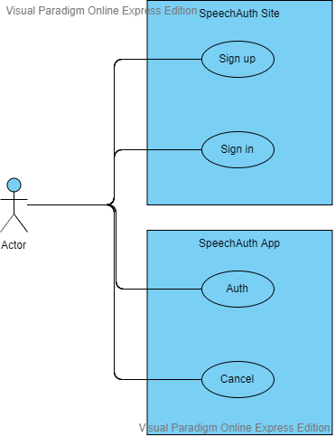

# Requirements

요구사항이란 걸 적어보자. 고객의 경우는 나 자신이며, 특정 누군가를 위해 만든게 아니므로 고객 요구사항 수집, 분석의 단계는 생략하거나 축소하는 단계를 거친다. 기능적 요구사항을 부각시키고 프로세스의 흐름을 간략하게 설명한다. 또한 설계 단계의 정확성을 위해 설계 요구사항을 명확하게 작성한다.

## Server application

### Functional requirements

Server는 크게 아래 3가지 기능의 요구사항을 가진다.

- 사용자 가입 요청 처리
- 사용자 로그인 요청 처리
- 사용자 인증 처리

여기서 사용자 인증 처리의 경우 사용자 로그인 요청 처리를 한 이후의 처리 과정이기 때문에 사용자 인증 처리를 단독으로 진행할 수 없다. 즉, 어떤 사용자인지 모른 상태에서 인증 처리를 할 수가 없다.

### Customer and design requirements

시스템 설계 시 개인적인 목표 달성을 위해 golang을 사용할 것이며, 다른 language를 사용한다 기능 요구사항을 만족 시켜야 한다. 테스트 가능한 REST API 형태로 구현해야 하며, github actions, packages 기능을 통해 자동화된 CI/CD가 진행되어야 한다.

## Android application

### Archectural requirements

- Android
- Flutter
- Dart

### Functional reuqirements

크게 인증하기와 취소하기로 구분할 수 있다.
사용자는 말하는 방법으로 인증 처리를 해야 하며, 취소 역시 말하는 방법으로 인증 처리를 해야 한다.

### Behaviour requirements

사용자는 미리 설치된 SpeechAuth 앱을 통해 로그인 이후 본인이 맞는지 인증 처리를 할 수 있다.
인증 처리 방법은 SpeechAuth 앱에서 인증 요청 알람이 왔을 때 로그인을 한 사이트에서 안내한 인증 코드를 "말해야" 한다.
올바른 인증 코드를 말하면 로그인을 한 사이트에서 로그인 프로세스가 진행되며, 다르게 얘기하면 인증코드가 잘못됐다는 알림 메시지를 확인할 수 있다.
인증 요청 알람이 왔을 떼 "취소" 라고 말하면 취소할 수 있다.
"취소'를 말하면 로그인을 한 사이트에서 로그인 프로세스가 진행되지 않는다.

### Design requirements

시스템 설계 시 안드로이드 앱 시스템 기반의 기능으로 설계해야 한다. 단 향후 유연한 기능 변경요구사항을 진행하기 위해 iOS 앱으로도 기능이 구현될 수 있도록 설계한다. 이를 위해 Flutter 프레임워크를 채택하여 구현할 수 있도록 한다.

## Web application

### Functional reuqirements

웹 어플리케이션은 크게 3가지 기능 요구사항을 가진다.

- Sign up
- Sign in
- Auth process

회원가입의 경우 google 계정 연동 기능으로 구현할 수 있도록 설계한다. 우선 구글 계정 회원 가입이 되게 진행 후 페이스북, 네이버 등의 계정 연동 기능을 구현한다.
로그인의 경우도 마찬가지로 google 계정 연동 기능으로 구현할 수 있도록 설계하고 페이스북, 네이버 계정 로그인 기능이 동작하도록 설계한다.
인증 과정의 경우 말해야 하는 코드를 화면에 보여줘야 하고 30초 이내에 말해야 하는 제한 시간을 둔다. 30초가 지나면 말해야하는 코드가 변경되고 이후 인증 앱에서는 변경된 코드를 말해야 한다.
인증 과정이 통과되면 로그인이 됐다는 화면으로 전환된다.

## Use case

어렵게 그리면 한없이 어렵기 때문에 쉽게 그려본다.
사용자가 하는 행위는 시스템 별로 아래 그림처럼 된다.

- SpeechAuth Site
  - Sign up: 회원가입
  - Sign in: 로그인
- SpeechAuth App
  - Auth: 사용자 인증
  - Cancel: 사용자 인증 취소
  